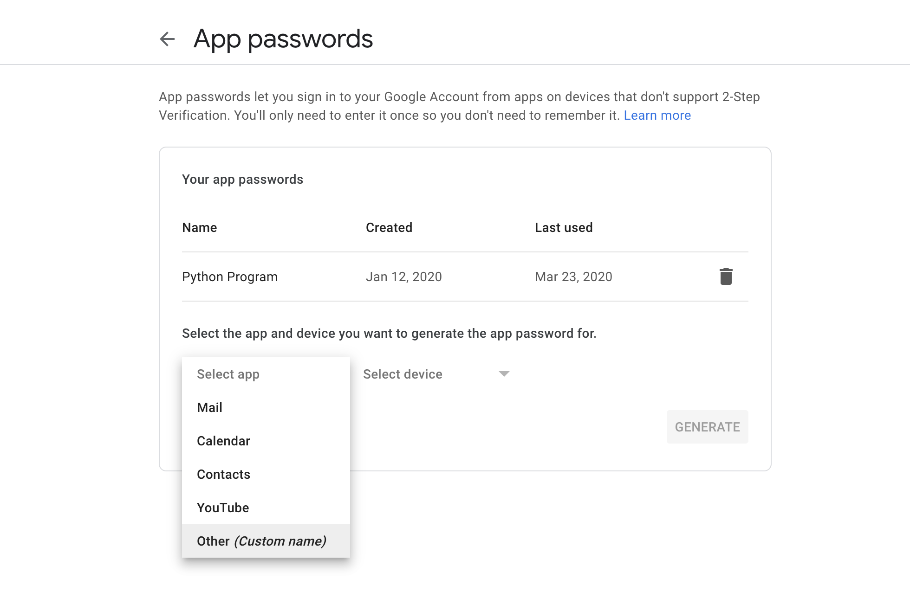

# TTT Roles Generator
---

### Purpose
For you (the user) and friends to be able to play [Trouble in Terrorist Town](https://www.troubleinterroristtown.com/) whether in person or in a video game. With this generator you will be able to use your Gmail account (no support for other emails as of now) to send the players' roles as SMS messages.

### Prerequisites
1. Ensure you have Python installed. If you do not, you can do so [here](https://www.python.org/downloads/).
2. You'll need to create an app password for your Google account to use for sending the messages to other players. 
   1. Navigate to your Google account security [settings](https://myaccount.google.com/intro/security) and under the **Signing in to Google** section, click **App passwords**.
   2. Click the **Select app** dropdown and choose **Other**. You will be prompted to name the password.
   3. Copy the password as you will not be able to retrieve it; and if lost, you will have to create a new password. 
   

### Usage
Here are the instructions to use the TTT Roles Generator:
1. Enter your email and password in the **recipients.txt** file in the designated fields labeled **email** and **password** respectively.
2. Add recipients separated by newlines under where it says **ENTER RECIPIENTS HERE**. Format the recipients as: *phone number*@*sms gateway*, *name*. Ex. 1234567890@vtext.com, John
3. Run the Python script
